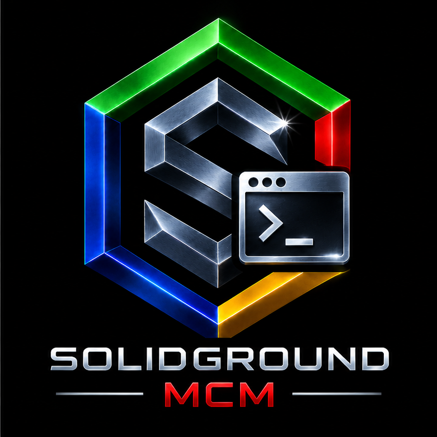

<table>
<tr>
<td width="170" align="center" valign="middle">
  
</td>
<td valign="middle">
  <big><big><big><strong>SolidGroundUX: Management Console Modules</strong></big></big></big><br>
  <sub>Version 2.1.2626414 · © 2026 Testadura</sub>
</td>
</tr>
</table>

<table>
<tr>
<td width="33%" align="center">
  <a href="https://testadura-consultancy.github.io/SolidgroundUX/"><strong>Documentation</strong></a><br>
  Product reference and guides
</td>
<td width="33%" align="center">
  <a href="CHANGELOG.md"><strong>Changelog</strong></a><br>
  Releases and development history
</td>
<td width="33%" align="center">
  <a href="LICENSE"><strong>License</strong></a><br>
  Terms of use and redistribution
</td>
</tr>
</table>

---

## About SolidGroundUX Management Console Modules

The **SolidGroundUX Management Console Modules** provide
system-management functionality for the SolidGroundUX Management
Console.

These modules were originally distributed as part of the standard
SolidGroundUX release. They are now maintained as a separate project so
that management functionality can evolve independently from the
SolidGroundUX framework itself.

SolidGroundUX provides the framework, runtime and shared utilities. This project owns the Management Console host, its public `sgnd-console` command, the console modules, and the management-specific executables that use the Framework.

## Architecture

Management Console modules are primarily **presentation and
orchestration components**.

A console module may:

-   register menu groups and menu items;
-   determine availability and display status;
-   provide lightweight read-only status or validation functions;
-   orchestrate other registered actions;
-   dispatch work to framework or management executables.

Persistent or reusable system-changing functionality should normally be
implemented in a separate executable rather than directly inside a
console module.

Conceptually:

``` text
Management Console
        │
        ▼
Console module
  menu registration
  presentation
  status / orchestration
        │
        ▼
Management executable
        │
        ▼
System changes
```

Executables created specifically to implement management functionality
belong to this project. Generic SolidGroundUX utilities remain part of
the SolidGroundUX framework project, even when a Management Console
module provides a menu entry for them.

For example, the Development module may expose framework utilities such
as workspace creation, deployment or release preparation without taking
ownership of those utilities.

## Framework integration

Management Console Modules depends on the SolidGroundUX Framework runtime and public APIs. Framework testing is split deliberately by ownership:

- The Framework provides the public `sgnd-smoketest` command for framework installation validation and interactive framework smoke tests.
- The Management Console Modules **Framework Test** page calls `sgnd-smoketest` for framework-owned suites.
- Console registration validation remains owned by Management Console Modules because module discovery, registration and handler validation are console-application concerns.
- Module validation remains owned by Management Console Modules and uses the canonical validator contract below.

The former Management Console-owned `framework-smoketest.sh` implementation and `sgnd-framework-smoketest` public command are no longer part of this product.

### Module validation contract

Every console module exposes a validator named:

```text
validate_module_<module-id-with-hyphens-replaced-by-underscores>
```

The validator may print detailed diagnostics and sets:

```text
SGND_MODULE_VALIDATION_MESSAGE=<concise summary>
```

It returns one of the standard validation states:

```text
0  Passed
1  Failed
2  Warning
3  Skipped / not applicable
```

Applicability is decided by the module itself. A missing canonical validator is a module-contract error rather than a skipped validation.

## DRYRUN contract

All persistent actions exposed through the Management Console must
respect the SolidGroundUX **DRYRUN** contract.

When DRYRUN is active, an action may inspect the system and report what
it would do, but it must not make persistent changes. This includes
changes to:

-   files and directories;
-   system or application configuration;
-   SolidGroundUX configuration or state;
-   services;
-   users and groups;
-   repositories;
-   remote systems.

Console modules must propagate DRYRUN to delegated executables. A
delegated action must not silently escape DRYRUN semantics.

DRYRUN output should describe intended actions using **Would ...** while the
preview is running, with enough detail to identify the relevant target, value,
file, service, user, repository, or remote system where practical. A mutating
action should finish its DRYRUN path with an explicit retrospective confirmation,
for example: **DRYRUN complete. The changes shown above would have been applied;
no changes were written.**

## Menu presentation

Modules and management executables that present menus should follow the
standard SolidGroundUX console layout.

Menu sections should use `sgnd_print_sectionheader` rather than ad-hoc
`Option: ...` headings or separators. The menu should have the standard
separator above the option section and an empty line after the final
menu option.

This keeps submenus visually consistent with the rest of the
SolidGroundUX Management Console.

## Project layout

Console modules are installed below the SolidGroundUX console-module
directory:

``` text
target-root/
└── usr/
    └── local/
        ├── lib/
        │   └── solidgroundux/
        │       └── common/
        │           └── active-directory-management.sh
        └── libexec/
            └── solidgroundux/
                ├── console-modules/
                │   ├── 10-computer-setup.sh
                │   ├── 15-storage.sh
                │   ├── 20-active-directory-server.sh
                │   ├── 25-active-directory-client.sh
                │   ├── 27-active-directory-management.sh
                │   ├── 30-samba-file-server.sh
                │   ├── 40-solidgroundux.sh
                │   ├── 45-solidground-framework-test.sh
                │   ├── 50-web-server.sh
                │   ├── 60-sqlserver.sh
                │   ├── 70-docker-server.sh
                │   └── 90-development.sh
                ├── manage-active-directory-client.sh
                ├── manage-active-directory-server.sh
                ├── manage-active-directory.sh
                ├── manage-docker-containers.sh
                ├── manage-docker-server.sh
                ├── manage-samba-file-server.sh
                ├── manage-samba-shares.sh
                ├── manage-solidgroundux.sh
                ├── manage-sqlserver.sh
                ├── manage-storage.sh
                ├── manage-web-server.sh
                ├── publish-web-content.sh
                └── set-identity.sh
```

Management-specific executables may live alongside the SolidGroundUX
executable tooling outside the `console-modules` directory. They remain
part of this project when their primary purpose is to implement
functionality owned by a Management Console module.

## Convenience templates

Canonical convenience templates are owned by the product that defines them and are installed below `usr/local/share/solidgroundux/convenience-templates`.

The SolidGroundUX Framework supplies the generic executable, library, documentation and wrapper templates. Management Console Modules supplies the console-module template because the module contract belongs to this product.

`create-workspace` discovers the installed convenience templates and lets the developer select which ones to copy into a new workspace. The copied templates become workspace-local starter/reference copies and may then be used to instantiate project starter scripts.

## Development principle

The boundary for this project is intentionally simple:

> **Console modules register and present functionality; executables
> implement functionality.**

Small presentation-only and read-only helpers may remain inside a module
where extracting them provides no practical benefit. Persistent
system-changing operations should live behind the module boundary in an
appropriate executable.

This separation keeps the Management Console modules small, makes
management actions independently testable, and provides a consistent
place to enforce framework conventions such as DRYRUN.
